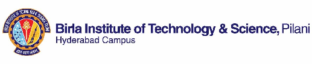

::: {.content-visible when-format="pdf"}

\begin{center}
    \includegraphics[width=0.8\textwidth]{logo.png}\\[4pt]
    {\large\bfseries SUMMER TERM 2026}\\[4pt]
    {\large\bfseries COURSE HANDOUT (PART-II)}\\[6pt]
    \rule{\textwidth}{1pt}
\end{center}

\vspace{-10pt}
\noindent
\textbf{Date:} May 21, 2026\\[6pt]
\noindent In addition to Part I (General Handout for all courses appended to the timetable) this portion gives further specific details regarding the course.\\[8pt]
\begin{tabular}{lll}
    \textbf{Course No.} & : & \textbf{CS F364} \\
    \textbf{Course Title} & : & \textbf{Design and Analysis of Algorithms} \\
    \textbf{Instructor-in-Charge} & : & \textbf{Tulasimohan Molli}
\end{tabular}

:::

::: {.content-visible unless-format="pdf"}

<div align="center">
  
  <h3>SUMMER TERM 2026</h3>
  <h4>COURSE HANDOUT (PART-II)</h4>
</div>

**Date:** May 21, 2026  
In addition to Part I (General Handout for all courses appended to the timetable) this portion gives further specific details regarding the course.

| Field | Detail |
|---|---|
| **Course No.** | CS F364 |
| **Course Title** | Design and Analysis of Algorithms |
| **Instructor-in-Charge** | Tulasimohan Molli |

:::

## 1. Scope and Objective of the Course

::: {.content-visible unless-format="revealjs"}

This course is an advanced study that follows Data Structures and Algorithms. It is designed to equip students with a deep understanding of major algorithmic design paradigms and the techniques required for their rigorous analysis. The curriculum covers the formal analysis of algorithm correctness, time complexity, and space complexity. Students will also explore the theory of computational complexity, focusing on problem intractability, the class of NP-complete problems, and methods for dealing with computationally hard challenges. The primary objectives are to impart the characteristics of different algorithmic paradigms, enabling students to:

:::

* Identify and apply suitable algorithmic paradigms and data structures to solve a given problem.  
* Rigorously argue and establish the time complexity of algorithms.  
* Develop formal proofs for the correctness of algorithms.  
* Understand the fundamental role of data structures in efficient algorithm implementation.  
* Grasp the concept of NP-completeness, lower bounds, and computational tractability.


## 2. Textbooks

1. **(T1)** Thomas H. Cormen, Charles E. Leiserson, Ronald L. Rivest, Clifford Stein. *Introduction to Algorithms*. Third Ed. MIT Press (2010).


## 3. Reference Books

1. **(R1)** Jon Kleinberg, Eva Tardos. *Algorithm Design*. First Ed. Pearson (2012).  
2. **(R2)** E. Horowitz, S. Sahni, S. Rajsekaran. *Fundamentals of Computer Algorithms*. Second Ed. Universities Press.  
3. **(R3)** R. Motwani, P. Raghavan. *Randomized Algorithms*. Cambridge University Press, 1995.  
4. **(R4)** G. Ausiello, et al. *Complexity and Approximation*. Springer.  
5. **(AR)** Additional Reading assignments / research papers.


## 4. Course Plan

::: {.content-visible when-format="pdf"}

\noindent
\begin{tabularx}{\textwidth}{c X X l}
    \toprule
    \textbf{Lec.} & \textbf{Learning Objectives} & \textbf{Topics} & \textbf{Reference} \\
    \midrule
    1--5 & Analyze efficiency via growth-of-function and asymptotic notations. & Intro to Growth of Function & T1: Ch 1--3 \\
    \addlinespace
    6--10 & Design and analyze Divide \& Conquer algorithms and recursion. & Divide and Conquer & T1: Ch 4, R1--2, AR \\
    \addlinespace
    11--13 & Formulate solutions for classical Dynamic Programming problems. & Dynamic Programming & T1: Ch 15, R1--2, AR \\
    \addlinespace
    14--20 & Apply greedy strategies and Matroid theory to prove optimality. & Greedy \& Matroid Theory & T1: Ch 16, 23--24, R1--2 \\
    \addlinespace
    21--26 & Model problems using Max-Flow Min-Cut and Randomization. & Network Flow \& Randomization & T1: Ch 26, 5, R1--3 \\
    \addlinespace
    27--33 & Analyze complexity classes (P, NP) and reduction techniques. & Complexity \& NP-Completeness & T1: Ch 34, R4, AR \\
    \addlinespace
    34--37 & Differentiate Backtracking, Branch \& Bound, and Approximation. & Hard Problem Techniques & T1: Ch 35, R2, R4 \\
    \addlinespace
    38--40 & Formulate and solve Linear Programming models with Simplex. & Linear Programming & T1: Ch 29, AR \\
    \addlinespace
    41--42 & Design and analyze parallel and multithreaded algorithms. & Parallel \& Multithreading & T1: Ch 27, R1--2, AR \\
    \bottomrule
\end{tabularx}

:::

::: {.content-visible when-format="html"}

| Lec. | Learning Objectives | Topics | Reference |
| :---: | :---: | :---: | :---: |
| **1-5** | Analyze efficiency via growth-of-function and asymptotic notations. | Intro to Growth of Function | T1: Ch 1-3 |
| **6-10** | Design and analyze Divide & Conquer algorithms and recursion. | Divide and Conquer | T1: Ch 4, R1-2, AR |
| **11-13** | Formulate solutions for classical Dynamic Programming problems. | Dynamic Programming | T1: Ch 15, R1-2, AR |
| **14-20** | Apply greedy strategies and Matroid theory to prove optimality. | Greedy & Matroid Theory | T1: Ch 16, 23-24, R1-2 |
| **21-26** | Model problems using Max-Flow Min-Cut and Randomization. | Network Flow & Randomization | T1: Ch 26, 5, R1-3 |
| **27-33** | Analyze complexity classes (P, NP) and reduction techniques. | Complexity & NP-Completeness | T1: Ch 34, R4, AR |
| **34-37** | Differentiate Backtracking, Branch & Bound, and Approximation. | Hard Problem Techniques | T1: Ch 35, R2, R4 |
| **38-40** | Formulate and solve Linear Programming models with Simplex. | Linear Programming | T1: Ch 29, AR |
| **41-42** | Design and analyze parallel and multithreaded algorithms. | Parallel & Multithreading | T1: Ch 27, R1-2, AR |

:::

::: {.content-visible when-format="revealjs"}

### Lectures 1--13 (Foundations & Core Design)
* **L1--5: Growth of Function**
  * Asymptotic notations, analyzing algorithm efficiency.
* **L6--10: Divide and Conquer**
  * Paradigms, recurrences, and divide-and-conquer analysis.
* **L11--13: Dynamic Programming**
  * Tabulation, memoization, formulation, and classical DP.

---

### Lectures 14--26 (Optimality & Advanced Flow)
* **L14--20: Greedy Strategy & Matroid Theory**
  * Optimality proofs, greedy choices, spanning trees, and Matroids.
* **L21--26: Network Flow & Randomization**
  * Max-Flow Min-Cut theorems, randomized algorithms.

---

### Lectures 27--42 (Complexity & Specialized Models)
* **L27--33: Complexity & NP-Completeness**
  * P, NP classes, reductions, and intractability.
* **L34--37: Hard Problem Techniques**
  * Backtracking, Branch & Bound, Approximation.
* **L38--40: Linear Programming**
  * Formulations and the Simplex algorithm.
* **L41--42: Parallel & Multithreading**
  * Parallel algorithms and complexity.

:::


## 5. Evaluation Scheme

::: {.content-visible when-format="pdf"}

\noindent
\begin{tabularx}{\textwidth}{X c c c X}
    \toprule
    \textbf{Component} & \textbf{Duration} & \textbf{Weightage} & \textbf{Date \& Time} & \textbf{Nature of Component} \\
    \midrule
    In-class Evaluation & 10--15 Mins each & 10\% & Surprise & Best 10 out of 12--15 quizzes \\
    \addlinespace
    2 Assignments & Take-home+ viva & 20\% & One before mid and one after mid. & Coding assignments: 5\% each \\
    \addlinespace
    Midterm Exam & 90 Mins & 30\% & 20/06/2026 & Closed Book \\
    \addlinespace
    Comprehensive Exam & 3 Hours & 40\% & 15/07/2026 & Closed Book \\
    \bottomrule
\end{tabularx}

:::

::: {.content-visible unless-format="pdf"}

| Component | Duration | Weightage (%) | Date & Time | Nature of Component |
| :--- | :---: | :---: | :---: | :--- |
| **In-class Evaluation** | 10-15 Mins each | 10% | Surprise | Best 10 out of 12-15 quizzes |
| **2 Assignments** | Take-home+ viva | 20% | One before mid and one after mid. | Coding assignments: 5% each; |
| **Midterm Exam** | 90 Mins | 30% | 20/06/2026 | Closed Book |
| **Comprehensive Exam** | 3 Hours | 40% | 15/07/2026 | Closed Book |

:::

**Note:** At least 40% of the evaluation components will be completed before the Mid-Semester grading.


## 6. Course Policies

### Chamber Consultation Hour
2 PM on Friday.

### Notices
The Learning Management System (LMS) or student email will serve as the primary platforms for all course-related announcements. Please note that certain specific guidelines may be provided exclusively during lectures.

### Make-up Policy
* **Assignments & Continuous Evaluation:** There is no provision for makeup components regarding assignments or in-class assessments. Submission timelines will be strictly observed.  
* **Midterm Exam:** Makeup for tests can be given only for genuine cases and that too with prior approval from the instructor in charge.  
* **Comprehensive Exam:** Makeup for the comprehensive exam will be decided as per instructions issued by AUGSD.


## 7. Academic Honesty and Integrity Policy

Academic honesty and integrity are to be maintained by all students throughout the semester and no type of academic dishonesty is acceptable.

::: {.content-visible when-format="pdf"}

```{=latex}
\vspace{24pt}
\begin{flushright}
    \begin{tabular}{c}
        \rule{4cm}{0.4pt} \\
        \textbf{Instructor-in-Charge} \\
        Tulasimohan Molli
    \end{tabular}
\end{flushright}
```

:::

::: {.content-visible when-format="html"}

```{=html}
<br><br>
<div style="text-align: right; padding-right: 2rem;">
  <hr style="width: 200px; display: inline-block; border: 0; border-top: 1px solid #2d3748;"><br>
  <strong>Instructor-in-Charge</strong><br>
  Tulasimohan Molli
</div>
```

:::
